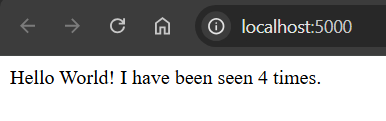
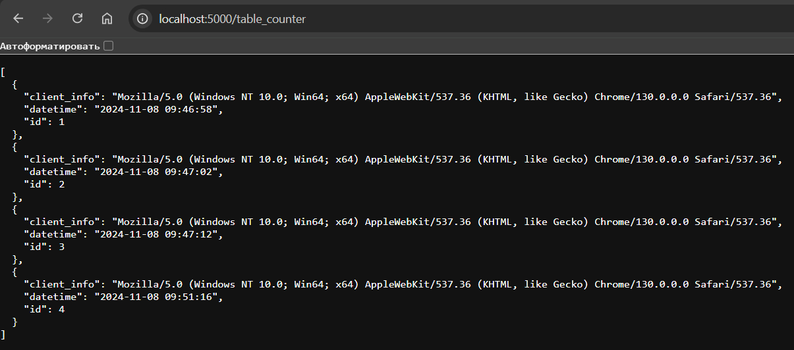
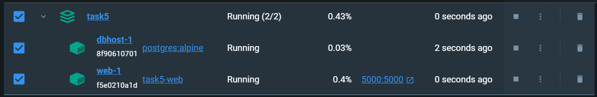
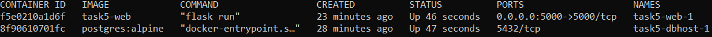

# Использование Docker в приложении Flask с БД

## Основные шаги

### 1. Скрипт, для создания БД

Создаем скрипт, который будет инициализировать БД table_counter при запуске
```
CREATE TABLE IF NOT EXISTS table_counter (
    id SERIAL PRIMARY KEY,
    datetime TIMESTAMP NOT NULL,
    client_info TEXT NOT NULL
);
```

### 2. Добавляем .env

Создаем файл .env для хранения информации для подключении к БД PostgreSQL

### 3. Изменение исходного файла app.py

Добавляем подключение к БД, добавляем код для сохранения данных о каждом запросе по эндпоинту '/' и добавляем возможность получения всей таблицы по эндпоинту 'table_counter'

```
from flask import Flask, request, jsonify
from datetime import datetime
import psycopg2
import os

app = Flask(__name__)

def get_db_connection():
    conn = psycopg2.connect(
        host=os.getenv("POSTGRES_HOST"),
        database=os.getenv("POSTGRES_DB"),
        user=os.getenv("POSTGRES_USER"),
        password=os.getenv("POSTGRES_PASSWORD")
    )
    return conn

@app.route('/')
def hello():
    conn = get_db_connection()
    with conn.cursor() as cursor:
        cursor.execute(
            "INSERT INTO table_counter (datetime, client_info) VALUES (%s, %s) RETURNING id;",
            (datetime.now(), request.headers.get('User-Agent'))
        )
        count = cursor.fetchone()[0]
        conn.commit()
    conn.close()
    return f'Hello World! I have been seen {count} times.\n'

@app.route('/table_counter', methods=['GET'])
def get_table_counter():
    conn = get_db_connection()
    with conn.cursor() as cursor:
        cursor.execute("SELECT id, datetime, client_info FROM table_counter;")
        rows = cursor.fetchall()
    conn.close()

    table = []
    for row in rows:
        table.append({
            "id": row[0],
            "datetime": row[1].strftime('%Y-%m-%d %H:%M:%S'),  # Преобразуем дату в строку
            "client_info": row[2]
        })
    
    return jsonify(table)

if __name__ == '__main__':
    app.run(host="0.0.0.0", port=5000)
```




### 4. Редактирование Dockerfile для Flask приложения

```
FROM python:3.7-alpine
WORKDIR /code
ENV FLASK_APP=app.py
ENV FLASK_RUN_HOST=0.0.0.0
RUN apk update && apk add --no-cache gcc musl-dev postgresql-dev
COPY requirements.txt requirements.txt
RUN pip install --no-cache-dir -r requirements.txt
EXPOSE 5000
COPY . .
CMD ["flask", "run"]
```

### 5. Определяем зависимости

```
flask
psycopg2
```

### 6. Редактируем docker-compose

Настраиваем контейнер для базы данных

```
services:
  web:
    build: .
    ports:
      - "5000:5000"
    volumes:
      - .:/code
    env_file: 
      - .env
    environment:
      FLASK_ENV: development
    depends_on:
      - dbhost

  dbhost:
    image: "postgres:alpine"
    environment:
      POSTGRES_DB: counterdb
      POSTGRES_USER: postgres
      POSTGRES_PASSWORD: password
    volumes:
      - pgdata:/var/lib/postgresql/data
      - ./init.sql:/docker-entrypoint-initdb.d/init.sql:ro

volumes:
  pgdata:
```

### 8. Запускаем приложение

``` 
docker-compose up --build
```


