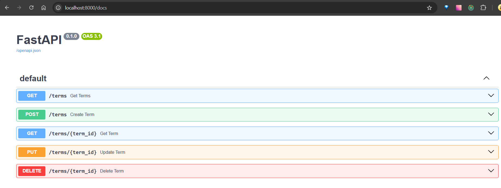
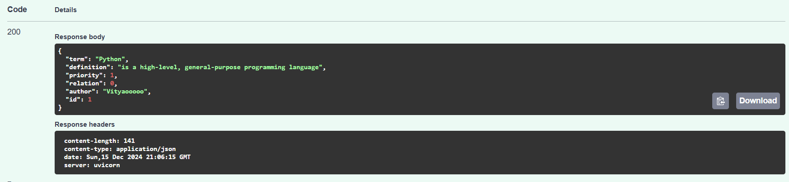
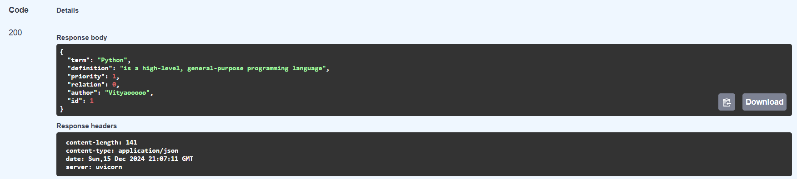
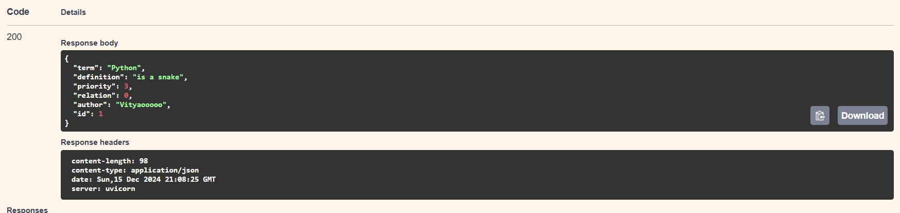
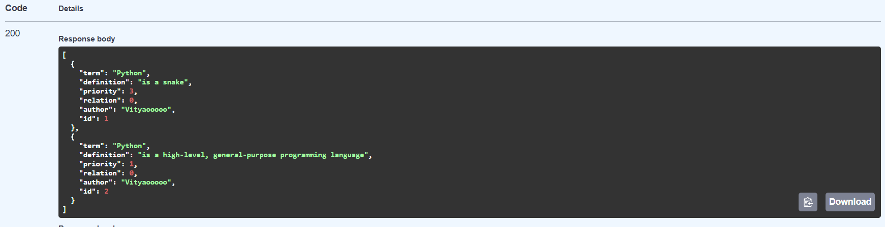
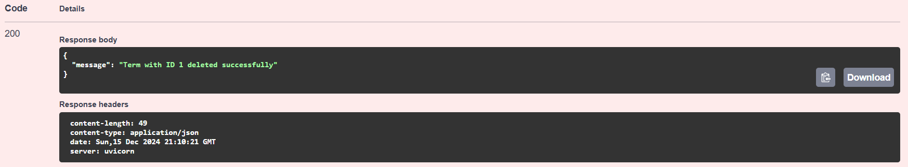

# REST. FastAPI. Swagger

## Основные шаги

### 1. Файл с зависимостями

Создаем файл requirements.txt, в котором описаны все зависимости
```
fastapi
uvicorn
sqlalchemy
pydantic
```

### 2. Добавляем типизацию

Для этого создаем файл schemas.py, в котором описываем основные типы данных
```
from pydantic import BaseModel
from typing import Optional

class TermBase(BaseModel):
    term: str
    definition: str
    priority: int
    relation: Optional[int] = None
    author: Optional[str] = "Vityaooooo"

class TermCreate(TermBase):
    pass

class TermUpdate(TermBase):
    pass

class TermResponse(TermBase):
    id: int

    class Config:
        orm_mode = True
```

### 3. Создаем модель для БД

Для этого создаем файл models.py, в котором описываем все типы данных ячеек и их название

```
from sqlalchemy import Column, Integer, String, ForeignKey
from sqlalchemy.orm import relationship
from .database import Base

class Term(Base):
    __tablename__ = "terms"

    id = Column(Integer, primary_key=True, index=True)
    term = Column(String, index=True, nullable=False)
    definition = Column(String, nullable=False)
    priority = Column(Integer, nullable=False)
    relation = Column(Integer, ForeignKey("terms.id"), nullable=True)
    author = Column(String, default="Vityaooooo")

    related_term = relationship("Term", remote_side=[id], backref="related_to")

```

### 4. Создаем скрипт для подключения к БД

Для этого создаем файл database.py

```
from sqlalchemy import create_engine
from sqlalchemy.ext.declarative import declarative_base
from sqlalchemy.orm import sessionmaker

DATABASE_URL = "sqlite:///./glossary.db"

engine = create_engine(DATABASE_URL, connect_args={"check_same_thread": False})
SessionLocal = sessionmaker(autocommit=False, autoflush=False, bind=engine)

Base = declarative_base()

def get_db():
    db = SessionLocal()
    try:
        yield db
    finally:
        db.close()

```

### 5. Реализуем функционал и роуты нашего приложения

Создаем файл main.py 

```
from fastapi import FastAPI, Depends, HTTPException
from sqlalchemy.orm import Session
from . import models, schemas
from .database import engine, Base, get_db

app = FastAPI()

Base.metadata.create_all(bind=engine)

@app.get("/terms", response_model=list[schemas.TermResponse])
async def get_terms(db: Session = Depends(get_db)):
    return db.query(models.Term).all()

@app.get("/terms/{term_id}", response_model=schemas.TermResponse)
async def get_term(term_id: int, db: Session = Depends(get_db)):
    term = db.query(models.Term).filter(models.Term.id == term_id).first()
    if not term:
        raise HTTPException(status_code=404, detail="Term not found")
    return term

@app.post("/terms", response_model=schemas.TermResponse)
async def create_term(term: schemas.TermCreate, db: Session = Depends(get_db)):
    new_term = models.Term(**term.dict())
    db.add(new_term)
    db.commit()
    db.refresh(new_term)
    return new_term

@app.put("/terms/{term_id}", response_model=schemas.TermResponse)
async def update_term(term_id: int, updated_term: schemas.TermUpdate, db: Session = Depends(get_db)):
    term = db.query(models.Term).filter(models.Term.id == term_id).first()
    if not term:
        raise HTTPException(status_code=404, detail="Term not found")
    for key, value in updated_term.dict(exclude_unset=True).items():
        setattr(term, key, value)
    db.commit()
    db.refresh(term)
    return term

@app.delete("/terms/{term_id}")
async def delete_term(term_id: int, db: Session = Depends(get_db)):
    term = db.query(models.Term).filter(models.Term.id == term_id).first()
    if not term:
        raise HTTPException(status_code=404, detail="Term not found")
    db.delete(term)
    db.commit()
    return {"message": f"Term with ID {term_id} deleted successfully"}
```

### 6. Создаем Dockerfile

Для создания контейнера нащего приложения создаем Dockerfile 

```
FROM python:3.11-slim

WORKDIR /app
COPY requirements.txt .
RUN pip install --no-cache-dir -r requirements.txt

COPY ./app /app/app

CMD ["uvicorn", "app.main:app", "--host", "0.0.0.0", "--port", "8000"]
```

### 7. Создаем docker-compose.yml

``` 
services:
  app:
    build:
      context: .
      dockerfile: Dockerfile
    ports:
      - "8000:8000"
    volumes:
      - .:/app
    command: uvicorn app.main:app --host 0.0.0.0 --port 8000 --reload
```

### 8. Запускаем приложение

``` 
docker-compose up --build
```





