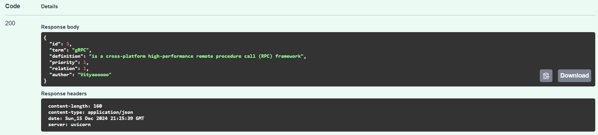
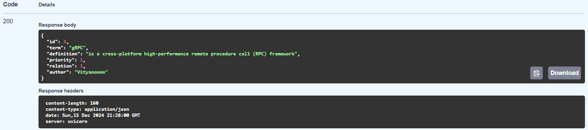
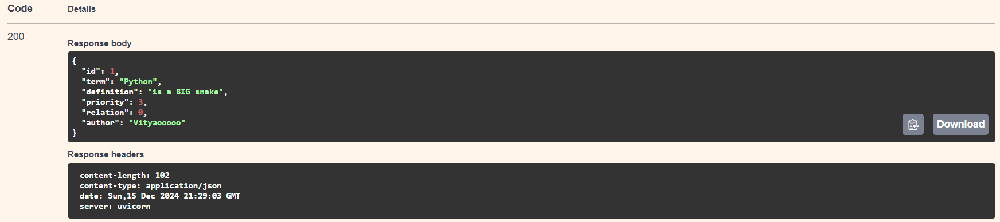
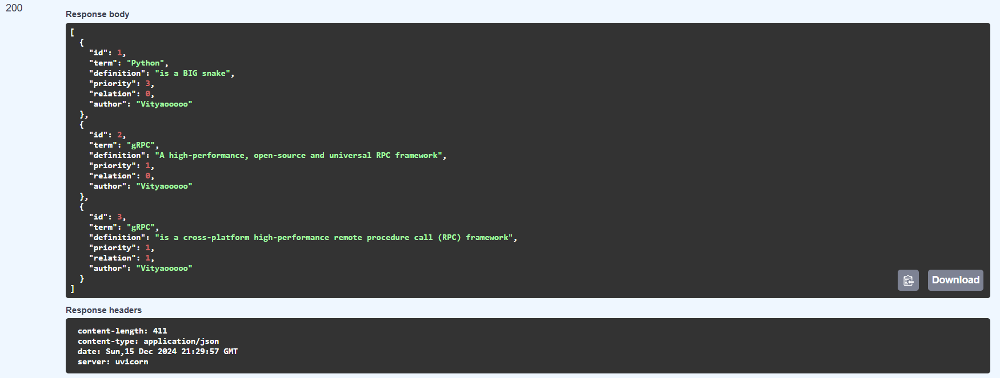
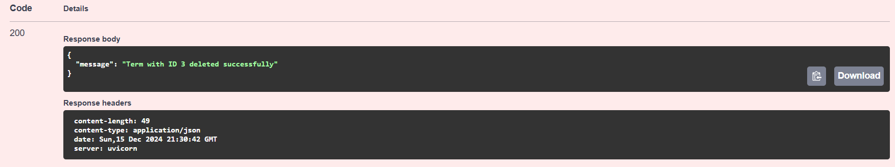

# REST. FastAPI. Swagger

## Основные шаги

### 1. Файл с зависимостями

Создаем файл requirements.txt, в котором описаны все зависимости
```
fastapi
uvicorn
sqlalchemy
pydantic
grpcio
grpcio-tools
```

### 2. Устанавливаем зависимости

Выполняем команду

```pip3 install requirements```

### 3. Добавляем типизацию

Для этого создаем файл schemas.py, в котором описываем основные типы данных
```
from pydantic import BaseModel
from typing import Optional

class TermBase(BaseModel):
    term: str
    definition: str
    priority: int
    relation: Optional[int] = None
    author: Optional[str] = "Vityaooooo"

class TermCreate(TermBase):
    pass

class TermUpdate(TermBase):
    pass

class TermResponse(TermBase):
    id: int

    class Config:
        orm_mode = True
```

### 4. Создаем модель для БД

Для этого создаем файл models.py, в котором описываем все типы данных ячеек и их название

```
from sqlalchemy import Column, Integer, String
from database import Base

class Term(Base):
    __tablename__ = "terms"
    id = Column(Integer, primary_key=True, index=True)
    term = Column(String, index=True)
    definition = Column(String)
    priority = Column(Integer, default=0)
    relation = Column(Integer, default=0)
    author = Column(String, default="Vityaooooo")
```

### 5. Создаем скрипт для подключения к БД

Для этого создаем файл database.py

```
from sqlalchemy import create_engine
from sqlalchemy.ext.declarative import declarative_base
from sqlalchemy.orm import sessionmaker

DATABASE_URL = "sqlite:///./glossary.db"

engine = create_engine(DATABASE_URL, connect_args={"check_same_thread": False})
SessionLocal = sessionmaker(autocommit=False, autoflush=False, bind=engine)

Base = declarative_base()

def get_db():
    db = SessionLocal()
    try:
        yield db
    finally:
        db.close()
```

### 6. Реализуем функционал и роуты нашего приложения

Создаем файл main.py 

```
import grpc
from concurrent import futures
from sqlalchemy.orm import Session
import models, schemas
from database import engine, Base, get_db
import glossary_pb2
import glossary_pb2_grpc


class GlossaryService(glossary_pb2_grpc.GlossaryServiceServicer):
    def __init__(self, db: Session):
        self.db = db

    def GetTerms(self, request, context):
        terms = self.db.query(models.Term).all()
        response = glossary_pb2.GetTermsResponse()
        for term in terms:
            term_response = glossary_pb2.TermResponse(
                id=term.id,
                term=term.term,
                definition=term.definition,
                priority=term.priority,
                relation=term.relation,
                author=term.author
            )
            response.terms.append(term_response)
        return response

    def GetTerm(self, request, context):
        term = self.db.query(models.Term).filter(models.Term.id == request.term_id).first()
        if not term:
            context.abort(grpc.StatusCode.NOT_FOUND, "Term not found")
        return glossary_pb2.TermResponse(
            id=term.id,
            term=term.term,
            definition=term.definition,
            priority=term.priority,
            relation=term.relation,
            author=term.author
        )

    def CreateTerm(self, request, context):
        new_term = models.Term(
            term=request.term,
            definition=request.definition,
            priority=request.priority,
            relation=request.relation,
            author=request.author
        )
        self.db.add(new_term)
        self.db.commit()
        self.db.refresh(new_term)
        return glossary_pb2.TermResponse(
            id=new_term.id,
            term=new_term.term,
            definition=new_term.definition,
            priority=new_term.priority,
            relation=new_term.relation,
            author=new_term.author
        )

    def UpdateTerm(self, request, context):
        term = self.db.query(models.Term).filter(models.Term.id == request.term_id).first()
        if not term:
            context.abort(grpc.StatusCode.NOT_FOUND, "Term not found")
        term.term = request.term
        term.definition = request.definition
        term.priority = request.priority
        term.relation = request.relation
        term.author = request.author
        self.db.commit()
        self.db.refresh(term)
        return glossary_pb2.TermResponse(
            id=term.id,
            term=term.term,
            definition=term.definition,
            priority=term.priority,
            relation=term.relation,
            author=term.author
        )

    def DeleteTerm(self, request, context):
        term = self.db.query(models.Term).filter(models.Term.id == request.term_id).first()
        if not term:
            context.abort(grpc.StatusCode.NOT_FOUND, "Term not found")
        self.db.delete(term)
        self.db.commit()
        return glossary_pb2.DeleteTermResponse(message=f"Term with ID {request.term_id} deleted successfully")


def serve():
    # Инициализация базы данных и создание всех таблиц
    Base.metadata.create_all(bind=engine)

    server = grpc.server(futures.ThreadPoolExecutor(max_workers=10))
    db_session = next(get_db())
    glossary_pb2_grpc.add_GlossaryServiceServicer_to_server(GlossaryService(db_session), server)
    server.add_insecure_port('[::]:50051')
    print("gRPC server started on port 50051")
    server.start()
    server.wait_for_termination()


if __name__ == '__main__':
    serve()
```

### 7. Создаем glossary.proto

Для реализации gRPC сервера неоюходимо создать glossary.proto

```
syntax = "proto3";

package glossary;

service GlossaryService {
    rpc GetTerms (GetTermsRequest) returns (GetTermsResponse);
    rpc GetTerm (GetTermRequest) returns (TermResponse);
    rpc CreateTerm (CreateTermRequest) returns (TermResponse);
    rpc UpdateTerm (UpdateTermRequest) returns (TermResponse);
    rpc DeleteTerm (DeleteTermRequest) returns (DeleteTermResponse);
}

message GetTermsRequest {}

message GetTermsResponse {
    repeated TermResponse terms = 1;
}

message GetTermRequest {
    int32 term_id = 1;
}

message TermResponse {
    int32 id = 1;
    string term = 2;
    string definition = 3;
    int32 priority = 4;
    int32 relation = 5;
    string author = 6;
}

message CreateTermRequest {
    string term = 1;
    string definition = 2;
    int32 priority = 3;
    int32 relation = 4;
    string author = 5;
}

message UpdateTermRequest {
    int32 term_id = 1;
    string term = 2;
    string definition = 3;
    int32 priority = 4;
    int32 relation = 5;
    string author = 6;
}

message DeleteTermRequest {
    int32 term_id = 1;
}

message DeleteTermResponse {
    string message = 1;
}
```

### 8. Генерируем файлы proto 

Скомпилируем файлы .proto с помощью grpcio-tools

``` 
python -m grpc_tools.protoc -I. --python_out=. --grpc_python_out=. glossary.proto
```

### 9. Запускаем сервер

Запускаем gRPC сервер на 50051 порту

``` 
python main.py
```

### 10. Создаем клиентскую часть

Реализовываем клиентскую часть на основе FastAPI в файле client_grpc.py

``` 
from fastapi import FastAPI
from pydantic import BaseModel
import grpc
import glossary_pb2
import glossary_pb2_grpc
from typing import List  # Добавляем импорт List из typing

# Создание экземпляра FastAPI
app = FastAPI()

# Определение Pydantic моделей для запросов
class TermCreateRequest(BaseModel):
    term: str
    definition: str
    priority: int
    relation: int = 0
    author: str = "Vityaooooo"

class TermResponse(BaseModel):
    id: int
    term: str
    definition: str
    priority: int
    relation: int
    author: str

    class Config:
        orm_mode = True

# gRPC клиент
def get_grpc_stub():
    channel = grpc.insecure_channel('localhost:50051')
    stub = glossary_pb2_grpc.GlossaryServiceStub(channel)
    return stub

@app.post("/terms/", response_model=TermResponse)
async def create_term(term: TermCreateRequest):
    stub = get_grpc_stub()

    # Создание запроса на создание термина
    create_request = glossary_pb2.CreateTermRequest(
        term=term.term,
        definition=term.definition,
        priority=term.priority,
        relation=term.relation,
        author=term.author
    )

    # Вызов gRPC метода для создания термина
    create_response = stub.CreateTerm(create_request)

    # Возвращаем ответ, преобразованный в модель Pydantic
    return TermResponse(
        id=create_response.id,
        term=create_response.term,
        definition=create_response.definition,
        priority=create_response.priority,
        relation=create_response.relation,
        author=create_response.author
    )

@app.get("/terms/", response_model=List[TermResponse])  # Используем List вместо list
async def get_terms():
    stub = get_grpc_stub()

    # Создаем запрос для получения всех терминов
    response = stub.GetTerms(glossary_pb2.GetTermsRequest())

    # Преобразуем ответ gRPC в список Pydantic моделей
    return [
        TermResponse(
            id=term.id,
            term=term.term,
            definition=term.definition,
            priority=term.priority,
            relation=term.relation,
            author=term.author
        )
        for term in response.terms
    ]

@app.get("/terms/{term_id}", response_model=TermResponse)
async def get_term(term_id: int):
    stub = get_grpc_stub()

    # Создаем запрос для получения термина по ID
    get_request = glossary_pb2.GetTermRequest(term_id=term_id)
    response = stub.GetTerm(get_request)

    # Возвращаем термин как Pydantic модель
    return TermResponse(
        id=response.id,
        term=response.term,
        definition=response.definition,
        priority=response.priority,
        relation=response.relation,
        author=response.author
    )

@app.put("/terms/{term_id}", response_model=TermResponse)
async def update_term(term_id: int, term: TermCreateRequest):
    stub = get_grpc_stub()

    # Создаем запрос на обновление термина
    update_request = glossary_pb2.UpdateTermRequest(
        term_id=term_id,
        term=term.term,
        definition=term.definition,
        priority=term.priority,
        relation=term.relation,
        author=term.author
    )

    # Вызов gRPC метода для обновления термина
    update_response = stub.UpdateTerm(update_request)

    # Возвращаем обновленный термин
    return TermResponse(
        id=update_response.id,
        term=update_response.term,
        definition=update_response.definition,
        priority=update_response.priority,
        relation=update_response.relation,
        author=update_response.author
    )

@app.delete("/terms/{term_id}", response_model=dict)
async def delete_term(term_id: int):
    stub = get_grpc_stub()

    # Создаем запрос на удаление термина
    delete_request = glossary_pb2.DeleteTermRequest(term_id=term_id)
    response = stub.DeleteTerm(delete_request)

    # Возвращаем сообщение об успешном удалении
    return {"message": response.message}
```


### 11. Запускаем клиентскую часть

Запускаем клиентскую на порту 8000

``` 
uvicorn client_grpc:app --reload
```




